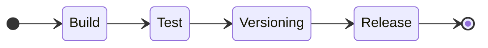
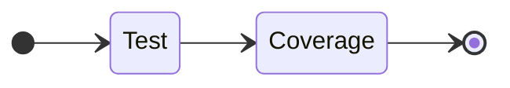

# CI/CD

## Continuous integration

### Build

| Permissions  | Triggers       |
| ------------ | -------------- |
| Read / Write | Push to `main` |

### Coverage

| Permissions | Triggers       |
| ----------- | -------------- |
| Read only   | Push to `main` |

